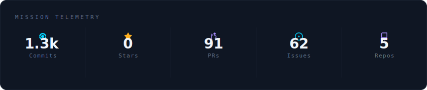

  

 

### 👨‍💻 Sobre Mim

Sou **Desenvolvedor Full Stack Junior** na **Stelmat** e estudante de **Ciência da Computação na UFMT** (Cuiabá-MT).
Apaixonado por criar sistemas robustos e escaláveis, meu foco atual é dominar o ecossistema **Java**, **Spring Boot** e práticas de **DevOps**.

> *"Transformando café e lógica em soluções escaláveis."*

 

  

 

  

 

  

 

  
  

